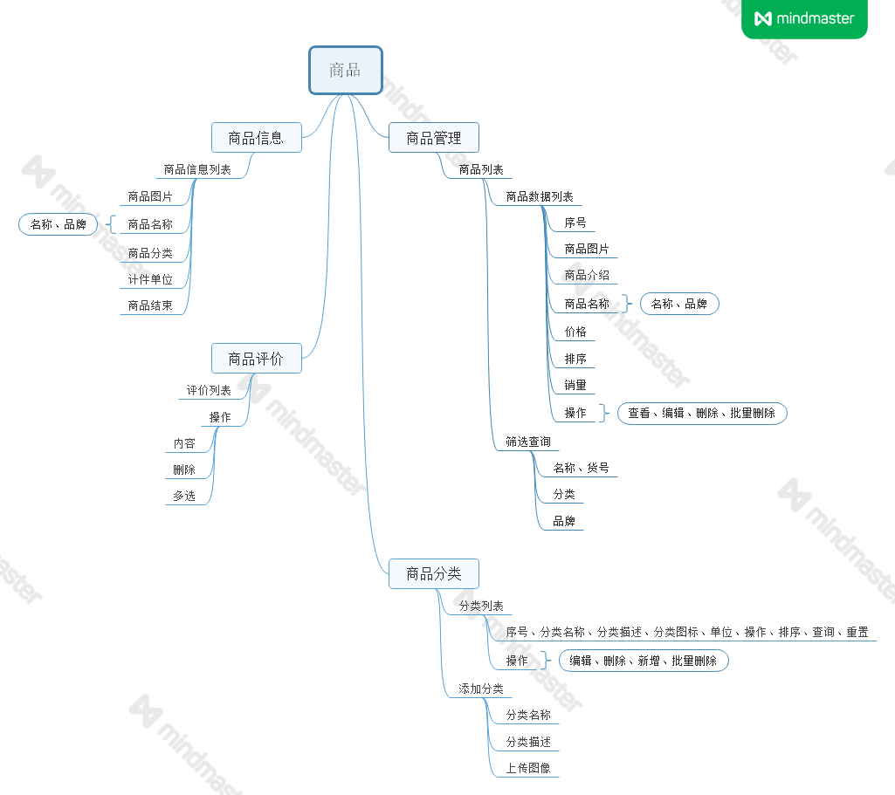
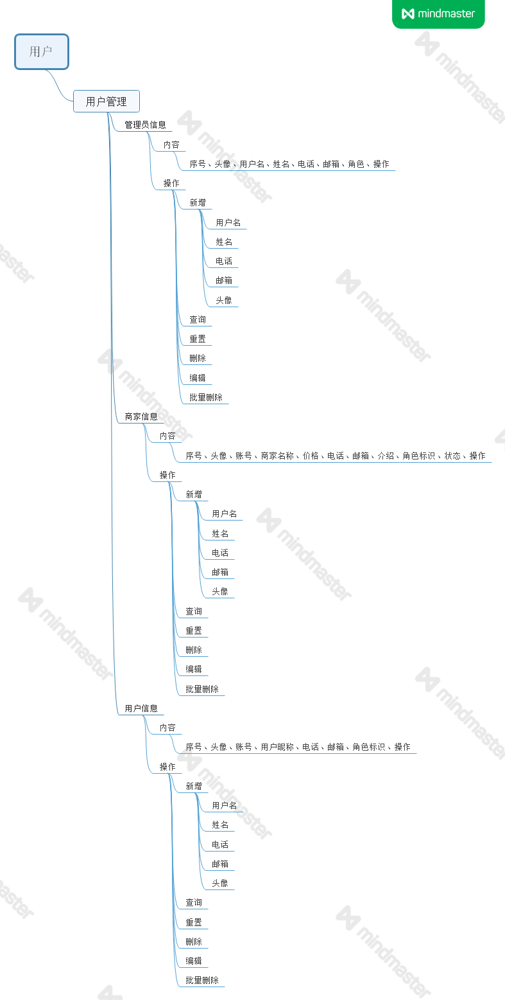
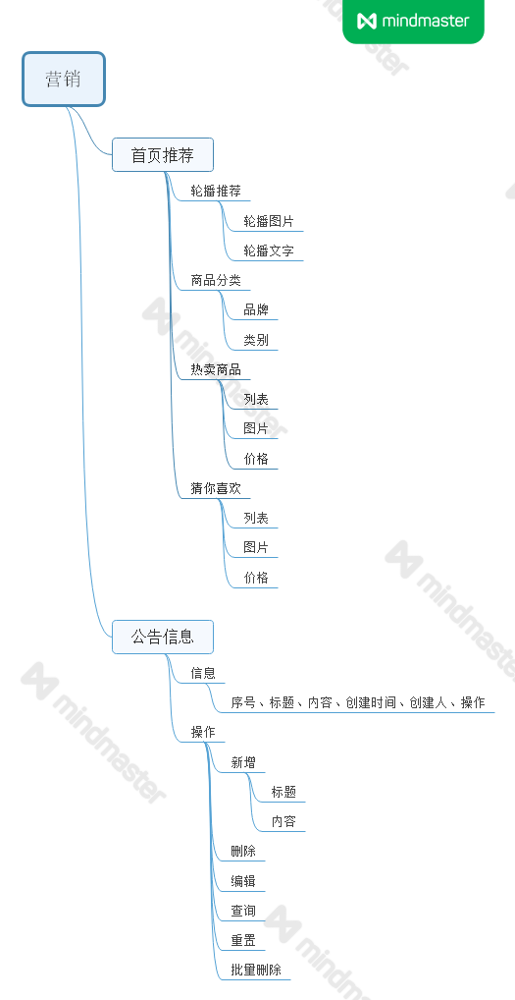

# 一 数据库搭建

使用工具：MYSQL、Navicat

>  数据库详细参见/document/sql/shopping_manager.sql

## 1.1 功能结构图

### 1.1.1 订单结构图
订单结构图
    

    
展开图片

   
    

### 1.1.2 商品结构图
商品结构图
    

    
展开图片

   
    

### 1.1.3 用户结构图
用户结构图
    

    
展开图片

   
    

### 1.1.4 营销结构图
营销结构图
    

    
展开图片

   
    
